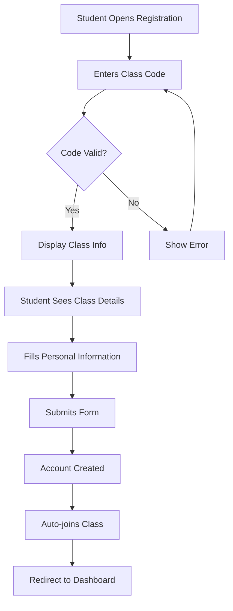

# Student Registration Enhancement Documentation

*Implementation completed: January 2025*

---

## Overview

The student registration system has been completely redesigned to provide a superior user experience through real-time class validation and dynamic information display. Students now enter their class code first and immediately see which class they're joining before completing registration.

---

## Key Changes Summary

### Before vs After

| Feature | Before | After |
|---------|--------|-------|
| **First Field** | Full Name | Class Code |
| **Username Field** | Required manual entry | Auto-generated from email |
| **School Selection** | Dropdown selection | Auto-displayed from class info |
| **Name Fields** | Single "Full Name" field | Separate "First Name" and "Last Name" |
| **Class Validation** | Only on form submission | Real-time as user types |
| **Class Information** | Not shown | Dynamically displayed |

---

## Technical Implementation

### 1. Backend API Enhancement

#### New Endpoint: Class Lookup
```javascript
GET /api/classes/lookup/:code
```

**Purpose**: Validates class codes and returns class information without requiring authentication

**Request**:
```
GET /api/classes/lookup/ABC1
```

**Success Response** (200):
```json
{
  "class_name": "Introduction to Podcasting",
  "subject": "Media Studies",
  "description": "Learn the basics of podcast production",
  "teacher_name": "Ms. Johnson",
  "school_name": "Lincoln High School"
}
```

**Error Responses**:
- `400 Bad Request`: Invalid code format
- `404 Not Found`: Code doesn't exist
- `400 Bad Request`: Class is inactive

**Implementation Location**: `/backend/routes/classes.js` (lines 487-540)

---

### 2. Frontend Form Structure

#### HTML Changes (`register-student.html`)

**New Form Field Order**:
1. **Class Code** (with validation indicator)
2. **Dynamic Class Info Display** (appears when valid code entered)
3. **First Name** (required)
4. **Last Name** (required)
5. **Email** (required)
6. **Student ID** (optional)
7. **Password** (required)
8. **Confirm Password** (required)

**Key HTML Elements**:
```html
<!-- Class Code Input with Status Indicator -->
<div class="class-code-input-wrapper">
    <input type="text" id="classCode" maxlength="4" required>
    <div class="class-code-status" id="classCodeStatus"></div>
</div>

<!-- Dynamic Class Information Display -->
<div class="class-info-display" id="classInfoDisplay">
    <div class="class-info-card">
        <h3 id="classInfoName">📚 Class Name</h3>
        <div class="class-details">
            <p><strong>Teacher:</strong> <span id="classInfoTeacher"></span></p>
            <p><strong>School:</strong> <span id="classInfoSchool"></span></p>
            <p id="classInfoSubject"><strong>Subject:</strong> <span></span></p>
        </div>
    </div>
</div>
```

---

### 3. JavaScript Functionality

#### Key Functions (`register-student.js`)

**`handleClassCodeInput(e)`**
- Formats input to uppercase alphanumeric
- Triggers validation when 4 characters entered
- Implements 500ms debounce for API calls

**`validateClassCode(code)`**
- Makes API call to `/classes/lookup/:code`
- Updates UI based on response
- Stores class info for form submission

**`displayClassInfo(classInfo)`**
- Shows class name, teacher, school
- Animates display with fade-in effect
- Updates all relevant UI elements

**`handleRegistration(e)`**
- Validates class code was verified
- Creates full name from first + last name
- Auto-generates username from email
- Handles two-step registration process

#### Global Variables
```javascript
let classValidationTimeout = null;  // Debounce timer
let isValidatingClass = false;      // Prevent duplicate requests
let currentClassInfo = null;        // Stores validated class data
```

---

### 4. CSS Styling

#### New Style Classes (`styles.css`)

**Class Code Validation States**:
- `.class-code-status.loading` - Shows spinner
- `.class-code-status.success` - Green checkmark (✅)
- `.class-code-status.error` - Red X (❌)

**Class Info Card**:
```css
.class-info-card {
    background: linear-gradient(135deg, #f8fafc 0%, #e2e8f0 100%);
    border: 2px solid var(--primary-color);
    border-radius: 12px;
    padding: 1.5rem;
}
```

**Animations**:
- Loading spinner rotation
- Fade-in transition for class info
- Smooth state transitions

---

## User Flow

### Registration Process



### Validation Sequence

1. **User types** → Input formatted to uppercase
2. **4 characters entered** → 500ms debounce timer starts
3. **Timer expires** → API call to validate code
4. **Response received** → UI updates with result
5. **Valid code** → Class info displayed, form unlocked
6. **Invalid code** → Error shown, must correct

---

## Features & Benefits

### For Students
✅ **Immediate Feedback** - Know instantly if class code is valid  
✅ **Confidence** - See class details before registering  
✅ **Simplified** - No username to remember (auto-generated)  
✅ **Faster** - No school dropdown to navigate  
✅ **Professional** - Modern, responsive interface  

### For Teachers
✅ **Fewer Errors** - Students verify class before joining  
✅ **Better Data** - Separate first/last names for records  
✅ **Less Support** - Clear validation reduces confusion  

### For Administrators
✅ **Cleaner Database** - Structured name fields  
✅ **Consistent Usernames** - Auto-generated from email  
✅ **Reduced Support Tickets** - Better UX means fewer issues  

---

## Mobile Responsiveness

### Breakpoints
- **Desktop** (>768px): Side-by-side name fields
- **Mobile** (<768px): Stacked form fields
- **All sizes**: Responsive class info card

### Touch Optimizations
- Large tap targets for all inputs
- Clear visual feedback on interactions
- Smooth animations that don't lag

---

## Error Handling

### Network Errors
- Shows user-friendly message
- Maintains form state
- Allows retry without data loss

### Validation Errors
- **Invalid class code**: "Invalid class code"
- **Inactive class**: "This class is no longer active"
- **Short code**: "Class code must be exactly 4 characters"
- **Unverified code**: "Please enter a valid class code and wait for verification"

### Form Errors
- **Password mismatch**: Clear error message
- **Missing fields**: HTML5 validation
- **Registration failure**: Detailed error from server

---

## Testing

### Test Coverage
✅ Form field structure and ordering  
✅ Real-time class code validation  
✅ Dynamic information display  
✅ Loading states and animations  
✅ Error handling for all scenarios  
✅ Mobile responsiveness  
✅ Form submission flow  
✅ Auto-username generation  

### Test File
`test-enhanced-registration.js` - Comprehensive Puppeteer test suite

### Manual Testing Checklist
- [ ] Enter invalid 4-character code → See error
- [ ] Enter valid class code → See class info
- [ ] Submit with unverified code → Get error
- [ ] Complete successful registration → Join class
- [ ] Test on mobile device → Responsive layout
- [ ] Test with slow network → Loading states work

---

## Deployment

### Files Modified
1. `/backend/routes/classes.js` - Added lookup endpoint
2. `/backend/frontend/register-student.html` - New form structure
3. `/backend/frontend/js/register-student.js` - Enhanced validation
4. `/backend/frontend/css/styles.css` - New styling

### Environment Requirements
- Node.js with Express
- PostgreSQL database
- Railway deployment platform
- No new dependencies required

### Database Impact
- No schema changes required
- Read-only lookup endpoint
- Uses existing classes, users, schools tables

---

## Future Enhancements

### Potential Improvements
1. **Class Preview** - Show class description in tooltip
2. **Multiple Classes** - Allow joining multiple classes during registration
3. **QR Codes** - Teachers generate QR codes for class codes
4. **Email Verification** - Verify email before joining class
5. **Batch Registration** - Teachers pre-register students

### Performance Optimizations
1. **Cache Class Lookups** - Redis cache for popular codes
2. **Rate Limiting** - Prevent abuse of lookup endpoint
3. **CDN Assets** - Serve CSS/JS from CDN
4. **Progressive Enhancement** - Work without JavaScript

---

## Troubleshooting

### Common Issues

**Issue**: Class code shows as invalid but teacher says it's correct
- **Solution**: Check for typos, ensure exactly 4 characters, try uppercase

**Issue**: Class info doesn't appear after entering code
- **Solution**: Check network connection, wait for validation to complete

**Issue**: Can't submit form even with valid code
- **Solution**: Ensure all required fields filled, passwords match

**Issue**: Registration succeeds but class join fails
- **Solution**: User can join class later from dashboard

### Debug Mode
Add `?debug=true` to URL to enable console logging:
```
/register-student.html?debug=true
```

---

## API Documentation

### Student Registration Flow

#### Step 1: Validate Class Code
```bash
GET /api/classes/lookup/ABC1
```

#### Step 2: Register Student
```bash
POST /api/students/register
{
  "username": "auto-generated",
  "email": "student@example.com",
  "password": "securepass",
  "name": "John Student",
  "student_id": "STU123",
  "school_id": null
}
```

#### Step 3: Join Class
```bash
POST /api/classes/join
Authorization: Bearer {token}
{
  "class_code": "ABC1"
}
```

---

## Security Considerations

### Protected Information
- Teacher emails not exposed in lookup
- No authentication required for lookup (by design)
- Rate limiting recommended for production

### Data Validation
- Server-side validation of all inputs
- SQL injection prevention via parameterized queries
- XSS protection through proper escaping

### Privacy
- Minimal data exposed in lookup endpoint
- No student data visible during registration
- Secure password handling with bcrypt

---

## Conclusion

The enhanced student registration system provides a modern, user-friendly experience that reduces errors and increases confidence. By validating class codes in real-time and showing class information upfront, students know exactly what they're joining before completing registration.

**Key Achievement**: Transformed a traditional form into an interactive, intelligent registration experience that guides students through the process with immediate feedback and validation.

---

*Last Updated: January 2025*  
*Version: 2.0.0*  
*Status: Production Ready*