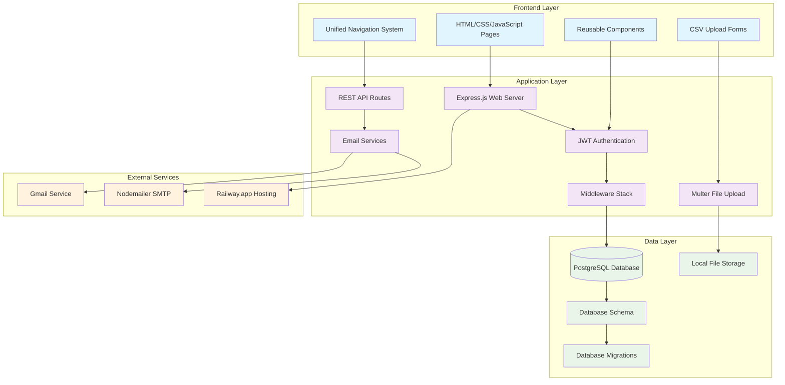
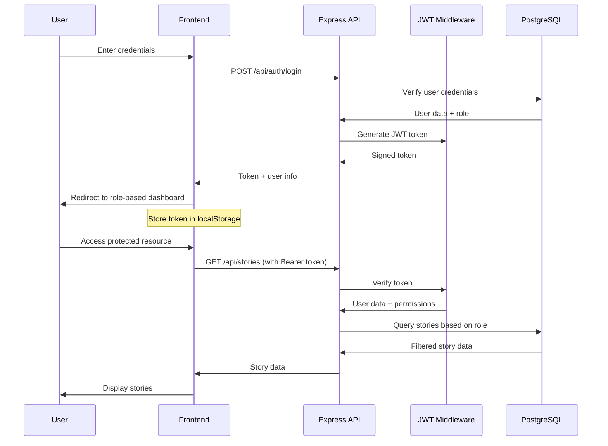
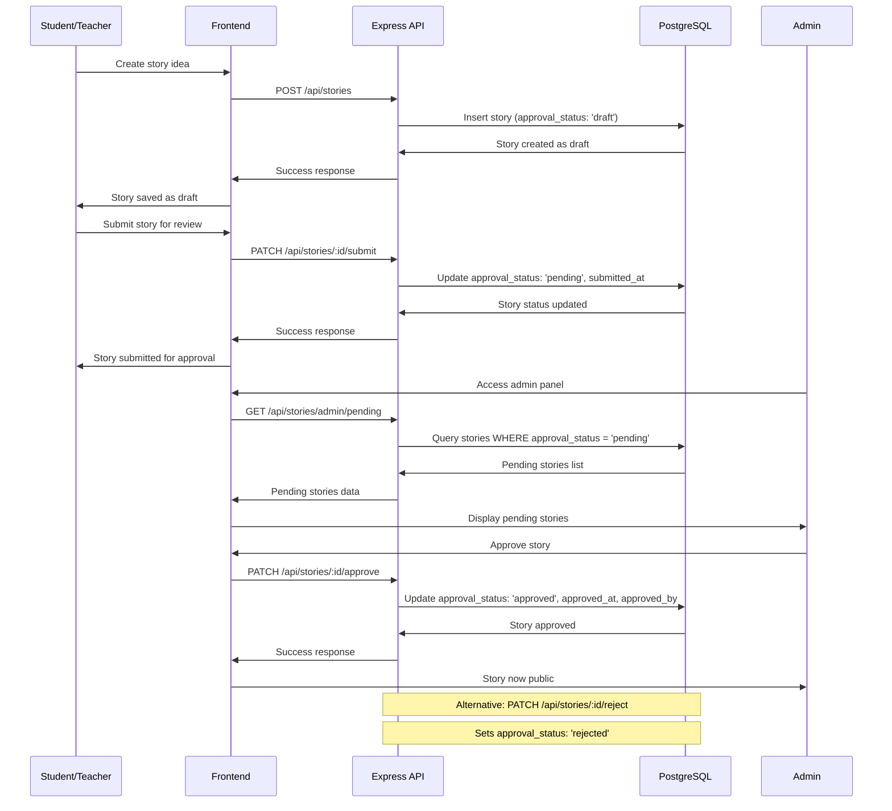
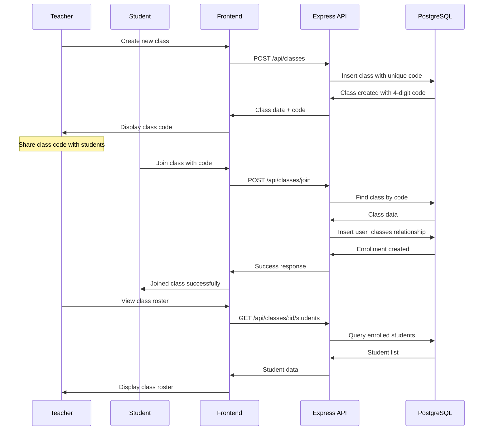

# VidPOD System Architecture Overview

*Comprehensive architectural documentation with interactive diagrams*

## Table of Contents
1. [High-Level Architecture](#high-level-architecture)
2. [Database Schema Relationships](#database-schema-relationships)
3. [API Routes Structure](#api-routes-structure)
4. [System Components](#system-components)
5. [Data Flow](#data-flow)
6. [Architectural Decisions](#architectural-decisions)
7. [Security Model](#security-model)
8. [Development Guidelines](#development-guidelines)

---

## High-Level Architecture

The VidPOD system follows a traditional three-tier web application architecture with clear separation between presentation, application, and data layers.



### Architecture Components

**Frontend Layer:**
- **HTML/CSS/JavaScript Pages**: Static frontend served by Express
- **Unified Navigation System**: Role-based navigation component
- **Reusable Components**: Shared UI elements and utilities
- **CSV Upload Forms**: Multer-based file upload interface

**Application Layer:**
- **Express.js Web Server**: Node.js server with static file serving
- **JWT Authentication**: Token-based authentication system
- **REST API Routes**: 17 modular route files
- **Middleware Stack**: Authentication, validation, error handling
- **Multer File Upload**: Local file processing for CSV imports
- **Email Services**: Dual email system (Gmail Service + Nodemailer SMTP)

**Data Layer:**
- **PostgreSQL Database**: Primary data store
- **Database Schema**: Multi-tier relational design
- **Database Migrations**: Version-controlled schema changes
- **Local File Storage**: Temporary CSV file storage (uploads/ directory)

---

## Database Schema Relationships

The database schema implements a comprehensive multi-tier system with role-based access control and content approval workflows.

```mermaid
erDiagram
    users {
        int id PK
        string username UK
        string password
        string email
        string school
        enum role
        timestamp created_at
        string name
        string student_id
        int teacher_id FK
        int school_id FK
    }
    
    schools {
        int id PK
        string school_name UK
        int created_by FK
        timestamp created_at
    }
    
    classes {
        int id PK
        string class_name
        string subject
        text description
        string class_code UK
        int teacher_id FK
        int school_id FK
        boolean is_active
        timestamp created_at
    }
    
    story_ideas {
        int id PK
        string idea_title
        text idea_description
        text question_1
        text question_2
        text question_3
        text question_4
        text question_5
        text question_6
        date coverage_start_date
        date coverage_end_date
        int uploaded_by FK
        timestamp uploaded_date
        string approval_status
        timestamp submitted_at
        timestamp approved_at
        int approved_by FK
        text approval_notes
    }
    
    tags {
        int id PK
        string tag_name UK
        int created_by FK
    }
    
    interviewees {
        int id PK
        string name UK
    }
    
    user_favorites {
        int id PK
        int user_id FK
        int story_id FK
        timestamp created_at
    }
    
    user_classes {
        int id PK
        int user_id FK
        int class_id FK
        timestamp joined_at
    }
    
    story_tags {
        int story_id FK
        int tag_id FK
    }
    
    story_interviewees {
        int story_id FK
        int interviewee_id FK
    }
    
    teacher_requests {
        int id PK
        string name
        string email UK
        int school_id FK
        text message
        enum status
        timestamp requested_at
        int approved_by FK
        timestamp approved_at
    }
    
    password_reset_tokens {
        int id PK
        int user_id FK
        string token UK
        timestamp expires_at
        boolean used
        timestamp created_at
    }
    
    story_analytics {
        int id PK
        int story_id FK
        int user_id FK
        string action_type
        string session_id
        inet ip_address
        text user_agent
        timestamp created_at
    }
    
    class_analytics {
        int id PK
        int class_id FK
        int student_id FK
        string activity_type
        int story_id FK
        jsonb metadata
        timestamp created_at
    }
    
    user_engagement {
        int id PK
        int user_id FK
        date date
        int login_count
        int stories_viewed
        int stories_favorited
        int time_spent_minutes
        timestamp last_activity
        timestamp created_at
        timestamp updated_at
    }
    
    story_approval_history {
        int id PK
        int story_id FK
        string previous_status
        string new_status
        int changed_by FK
        text notes
        timestamp changed_at
    }
    
    %% Relationships
    users ||--o{ story_ideas : uploads
    users ||--o{ user_favorites : creates
    users ||--o{ user_classes : enrolls
    users ||--o{ teacher_requests : requests
    users ||--|| schools : belongs_to
    users ||--o{ users : teaches
    
    schools ||--o{ classes : hosts
    schools ||--o{ teacher_requests : receives
    
    classes ||--|| users : taught_by
    classes ||--o{ user_classes : contains
    
    story_ideas ||--o{ user_favorites : favorited_by
    story_ideas ||--o{ story_tags : tagged_with
    story_ideas ||--o{ story_interviewees : features
    
    tags ||--o{ story_tags : applied_to
    interviewees ||--o{ story_interviewees : featured_in
    
    %% Junction table relationships
    user_favorites }|--|| users : user
    user_favorites }|--|| story_ideas : story
    
    user_classes }|--|| users : user  
    user_classes }|--|| classes : class
    
    story_tags }|--|| story_ideas : story
    story_tags }|--|| tags : tag
    
    story_interviewees }|--|| story_ideas : story
    story_interviewees }|--|| interviewees : interviewee
    
    teacher_requests }|--|| users : requester
    teacher_requests }|--|| schools : school
    teacher_requests }|--|| users : processor
```

### Schema Design Principles

**Multi-Tier Role System:**
- `amitrace_admin`: Full system access and approval powers
- `teacher`: Class management and content creation
- `student`: Content consumption and limited creation

**Content Approval Workflow:**
- Stories use approval_status (draft, pending, approved, rejected)
- Teacher registration requires admin approval via teacher_requests
- Role-based content access control

**Database Structure Notes:**
- *Core Schema*: [`backend/db/schema.sql`](../../backend/db/schema.sql) - Basic tables (users, story_ideas, tags, interviewees)
- *Extended Schema*: [`backend/db/updated-schema.sql`](../../backend/db/updated-schema.sql) - Multi-tier system (schools, classes, teacher_requests)
- *Migration 007*: [`backend/migrations/007_create_user_favorites.sql`](../../backend/migrations/007_create_user_favorites.sql) - Favorites system
- *Migration 008*: [`backend/migrations/008_create_analytics_tables.sql`](../../backend/migrations/008_create_analytics_tables.sql) - Analytics tables
- *Migration 010*: [`backend/migrations/010_phase2_story_approval.sql`](../../backend/migrations/010_phase2_story_approval.sql) - Story approval workflow

**Authentication Notes:**
- Login is **email-only** - username field exists in database but is not used for authentication
- All API authentication endpoints expect email as the login identifier

**API Response Field Mapping:**
- **Stored Fields**: All fields directly from database tables (e.g., `story_ideas.idea_title`, `users.email`)
- **Derived via JOINs**: 
  - `uploaded_by_name` = COALESCE(users.name, users.email)
  - `uploaded_by_email` = users.email 
  - `uploaded_by_school` = users.school
  - `tags` = array_agg(tags.tag_name) from story_tags junction
  - `interviewees` = array_agg(interviewees.name) from story_interviewees junction
  - `favorite_count` = COUNT(user_favorites.id)

**Relationship Management:**
- Many-to-many relationships via junction tables
- Foreign key constraints ensure data integrity
- Limited soft deletion (only `classes` table has `is_active`)

---

## API Routes Structure

The API is organized into 17 modular route files, each handling specific domain functionality with consistent authentication and authorization patterns.

```mermaid
graph TD
    subgraph "Authentication (/api/auth/)"
        AUTH_LOGIN[POST /login]
        AUTH_REGISTER[POST /register]
        AUTH_VERIFY[GET /verify]
    end
    
    subgraph "Stories (/api/stories/)"
        STORIES_LIST[GET /]
        STORIES_GET[GET /:id]
        STORIES_CREATE[POST /]
        STORIES_UPDATE[PUT /:id]
        STORIES_DELETE[DELETE /:id]
        STORIES_IMPORT[POST /import]
        STORIES_PENDING[GET /admin/pending]
        STORIES_STATUS[GET /admin/by-status/:status]
        STORIES_SUBMIT[PATCH /:id/submit]
        STORIES_APPROVE[PATCH /:id/approve]
        STORIES_REJECT[PATCH /:id/reject]
        STORIES_HISTORY[GET /:id/approval-history]
        STORIES_STATS[GET /admin/stats]
        STORIES_BULK[POST /admin/bulk-approve]
    end
    
    subgraph "Classes (/api/classes/)"
        CLASSES_LIST[GET /]
        CLASSES_GET[GET /:id]
        CLASSES_CREATE[POST /]
        CLASSES_UPDATE[PUT /:id]
        CLASSES_DELETE[DELETE /:id]
        CLASSES_JOIN[POST /join]
        CLASSES_LEAVE[POST /:id/leave]
        CLASSES_STUDENTS[GET /:id/students]
        CLASSES_REMOVE[DELETE /:id/students/:studentId]
        CLASSES_REGEN[POST /:id/regenerate-code]
        CLASSES_LOOKUP[GET /lookup/:code]
    end
    
    subgraph "User Management (/api/user-management/)"
        USER_TEACHERS[GET /teachers]
        USER_TEACHER_IMPACT[GET /teacher/:id/impact]
        USER_DELETE_TEACHER[DELETE /teacher/:id]
        USER_ADMINS[GET /admins]
        USER_CREATE_ADMIN[POST /admin]
        USER_DELETE_ADMIN[DELETE /admin/:id]
        USER_BULK_DELETE[POST /bulk-delete]
        USER_STATS[GET /stats]
        USER_HEALTH[GET /health]
    end
    
    subgraph "Favorites (/api/favorites/)"
        FAV_LIST[GET /]
        FAV_ADD[POST /:storyId]
        FAV_REMOVE[DELETE /:storyId]
        FAV_POPULAR[GET /popular]
        FAV_CHECK[GET /:storyId/check]
        FAV_STATS[GET /stats]
    end
    
    subgraph "Analytics (/api/analytics/)"
        ANALYTICS_TRACK[POST /track]
        ANALYTICS_TEACHER[GET /teacher/dashboard]
        ANALYTICS_ADMIN[GET /admin/dashboard]
        ANALYTICS_CLASS[GET /class/:classId]
    end
    
    subgraph "Admin Functions"
        SCHOOLS_PUBLIC[GET /api/schools/public]
        SCHOOLS_LIST[GET /api/schools/]
        SCHOOLS_CREATE[POST /api/schools/]
        TEACHER_REQ_LIST[GET /api/teacher-requests/]
        TEACHER_REQ_APPROVE[POST /api/teacher-requests/:id/approve]
        TEACHER_REQ_REJECT[POST /api/teacher-requests/:id/reject]
        ADMIN_TEACHERS[GET /api/admin/teachers/]
        TAGS_MANAGE[GET|POST|PUT|DELETE /api/tags/]
    end
    
    subgraph "Utility Routes"
        PASSWORD_RESET[POST /api/password-reset/request]
        PASSWORD_VERIFY[GET /api/password-reset/verify/:token]
        STUDENT_REG[POST /api/students/register]
        DEBUG_ENV[GET /api/debug/env-check]
        MIGRATION_ROUTES[GET /api/migration/*]
    end
    
    classDef auth fill:#fff3e0
    classDef admin fill:#ffebee
    classDef protected fill:#e8f5e8
    classDef utility fill:#f3e5f5
    
    class AUTH_LOGIN,AUTH_REGISTER,AUTH_VERIFY auth
    class SCHOOLS_LIST,SCHOOLS_CREATE,TEACHER_REQ_LIST,TEACHER_REQ_APPROVE,ADMIN_TEACHERS,TAGS_MANAGE admin
    class STORIES_LIST,CLASSES_LIST,FAV_LIST,ANALYTICS_TRACK protected
    class PASSWORD_RESET,STUDENT_REG,DEBUG_ENV,MIGRATION_ROUTES utility
```

### API Route Categories

**Authentication Routes (`/api/auth/`):**
- User login/logout with JWT tokens
- Registration with role-based approval
- Token verification and refresh

**Story Management (`/api/stories/`):**
- CRUD operations with approval workflow
- CSV import/export functionality
- Search and filtering capabilities

**User Management (`/api/users/`):**
- Profile management and updates
- Role-based user administration
- Teacher approval workflow

**Class Management (`/api/classes/`):**
- Class creation and management
- Student enrollment with class codes
- Teacher-student relationship tracking

**Content Management (`/api/tags/`):**
- Tag system for story categorization  
- Admin-only CRUD operations for tags
- Many-to-many relationship with stories via story_tags

**Interviewees System (Database Only):**
- `interviewees` table exists in database schema
- Junction table `story_interviewees` for many-to-many relationships  
- *API endpoints not implemented* - future enhancement opportunity
- Currently handled via text fields in story creation forms

**Favorites System (`/api/favorites/`):**
- User favorites with real-time updates
- Popular content analytics
- Engagement tracking

**Admin Functions (`/api/schools/`, `/api/teacher-requests/`, `/api/admin/`, `/api/user-management/`):**
- School management and creation (`/api/schools/`)
- Teacher approval workflow (`/api/teacher-requests/`)
- Teacher management (`/api/admin/teachers/`)
- System analytics and user management (`/api/user-management/`)

**Analytics System (`/api/analytics/`):**
- Event tracking for user interactions
- Teacher dashboard analytics
- Admin dashboard metrics
- Class-specific analytics

---

## System Components

### Frontend Architecture

**Unified Navigation System:**
- Single navigation template (`includes/navigation.html`)
- Role-based menu visibility
- Mobile-responsive design
- Auto-loading across all authenticated pages

**Page Structure:**
- Authentication pages (no navigation): Login, registration, password reset
- Authenticated pages (with navigation): Dashboard, stories, admin panels
- Error pages: 404 with custom navigation

**JavaScript Organization:**
- Modular ES6+ JavaScript with fetch API
- Role-specific functionality separation
- Shared utilities and components
- Mobile-first responsive design

### Backend Architecture

**Express.js Server:**
- Static file serving for frontend
- RESTful API with consistent patterns
- Middleware stack for authentication, validation, error handling
- Environment-based configuration

**Authentication System:**
- JWT tokens with HS256 algorithm
- 7-day token expiration
- Role-based access control
- Secure password hashing with bcrypt

**Database Layer:**
- PostgreSQL with complex relational schema
- Migration system for version control
- Connection pooling and optimization
- Foreign key constraints and data integrity

### Security Model

**Authentication:**
- Email-based login system
- JWT tokens stored in localStorage (7-day expiration)
- Bearer token authentication for API calls
- Manual re-authentication required after token expiry

*Security Considerations:*
- localStorage is used for token storage (XSS vulnerable)
- Production systems should consider HTTP-only cookies for enhanced security
- Token refresh not currently implemented (future enhancement backlog item)

**Authorization:**
- Three-tier role system with inheritance
- Route-level authorization middleware
- Resource-specific permissions
- Admin approval workflows

**Data Protection:**
- SQL injection prevention with parameterized queries
- Password hashing with bcrypt
- Input validation and sanitization
- CORS configuration for API access

---

## Data Flow

### User Authentication Flow



### Story Creation and Approval Flow



### Class Management Flow



---

## Architectural Decisions

### Technology Choices

**Backend Framework: Express.js**
- Mature, stable Node.js framework
- Excellent middleware ecosystem
- Simple REST API development
- Static file serving capabilities

**Database: PostgreSQL**
- ACID compliance for data integrity
- Advanced relationship handling
- JSON support for flexible data
- Excellent performance and scalability

**Authentication: JWT**
- Stateless authentication model
- Cross-domain compatibility
- Client-side token storage
- Role-based payload embedding

**Frontend: Vanilla JavaScript**
- No framework overhead
- Direct browser APIs
- Easier maintenance and debugging
- Custom component architecture

### Design Patterns

**Three-Tier Architecture:**
- Clear separation of concerns
- Scalable and maintainable
- Technology independence
- Team specialization support

**RESTful API Design:**
- Standard HTTP methods and status codes
- Resource-based URL structure
- Consistent request/response patterns
- Stateless operation model

**Role-Based Access Control:**
- Hierarchical permission model
- Fine-grained access control
- Secure by default approach
- Audit trail capability

**Unified Component System:**
- Single source of truth for navigation
- Consistent user experience
- Maintenance efficiency
- Role-based customization

---

## Development Guidelines

### Code Organization

**Backend Structure:**
```
backend/
├── server.js              # Main application entry
├── db/                    # Database schemas and migrations
├── routes/                # API endpoint modules
├── middleware/            # Authentication and validation
├── services/              # Email and external integrations
└── frontend/              # Static frontend files
```

**Frontend Structure:**
```
frontend/
├── *.html                 # Page templates
├── css/styles.css         # Application styling
├── js/                    # JavaScript modules
├── includes/              # Reusable components
└── assets/                # Static assets
```

### Development Workflow

1. **Feature Development:**
   - Create feature branch from main
   - Implement backend API changes
   - Update frontend components
   - Add comprehensive tests
   - Update documentation

2. **Database Changes:**
   - Create migration file
   - Test migration locally
   - Update schema documentation
   - Deploy to production

3. **API Development:**
   - Follow RESTful conventions
   - Implement proper authentication
   - Add input validation
   - Document endpoints

4. **Frontend Development:**
   - Maintain responsive design
   - Follow accessibility guidelines
   - Implement error handling
   - Test across browsers

### Testing Strategy

**Unit Testing:**
- Individual function testing
- API endpoint testing
- Database operation testing
- Authentication flow testing

**Integration Testing:**
- End-to-end user workflows
- Cross-component interaction
- Database relationship testing
- External service integration

**Manual Testing:**
- User experience validation
- Cross-browser compatibility
- Mobile responsive design
- Accessibility compliance

### Deployment Process

1. **Development Environment:**
   - Local PostgreSQL database
   - Environment variable configuration
   - Hot reloading for development

2. **Production Deployment:**
   - Railway.app automatic deployment
   - Environment variable management
   - Database migration execution
   - Health check validation

---

## Performance Considerations

### Database Optimization

**Indexing Strategy:**
- Primary keys on all tables
- Foreign key indexes
- Unique constraints on business keys
- Query-specific indexes

**Query Optimization:**
- Parameterized queries
- Connection pooling
- Result set pagination
- Efficient JOIN operations

### Frontend Performance

**Asset Optimization:**
- CSS minification
- JavaScript bundling
- Image optimization
- Caching strategies

**User Experience:**
- Progressive loading
- Error state handling
- Loading indicators
- Responsive design

### Scalability Considerations

**Horizontal Scaling:**
- Stateless application design
- Database connection pooling
- Load balancer compatibility
- Session management

**Vertical Scaling:**
- Memory optimization
- CPU utilization monitoring
- Database query optimization
- Caching implementation

---

*This document serves as the primary architectural reference for the VidPOD system. For specific implementation details, refer to the individual component documentation and developer onboarding guide.*